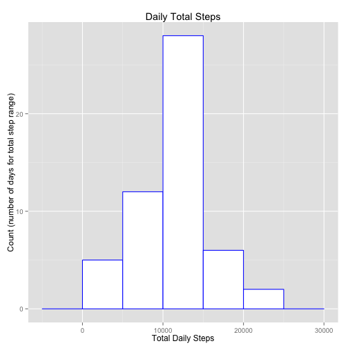
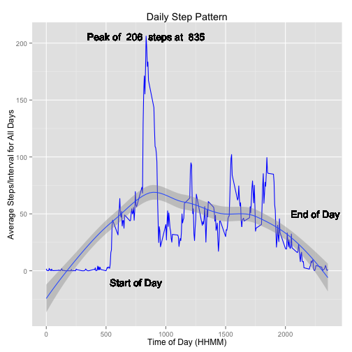
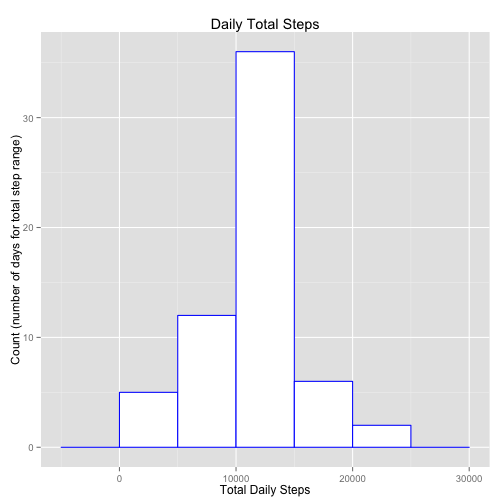
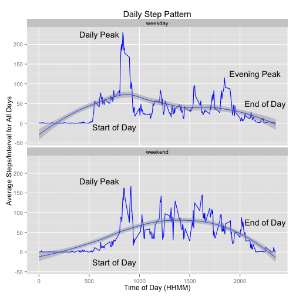

# Reproducible Research: Peer Assessment 1


Welcome to Reproducible Research Peer Assignment 1.

This assignment makes use of data from a personal activity monitoring
device. This device collects data at 5 minute intervals through out the
day. The data consists of two months of data from an anonymous
individual collected during the months of October and November, 2012
and include the number of steps taken in 5 minute intervals each day.

The time series is already defined by the interval -- 
the interval is an integer rendering of when the activity
(steps) were sampled.  The interval represents time
in form of 24 hour format HHMM.  For integer values of 
less than 4 digits, merely add preceding zeroes to
pad to 4 digits.

For example:

- An interval of 0 == 0000, or 00:00 which is midnight.
- Similarly an interval of 1200 is equivalent to 12:00, or noon.

The time zone is not specified, and not relevant for this study.

We will be exploring patterns for:

- Daily step totals
- Step patterns during intervals over the the entire collection
period
- Step patterns during intervals comparing week (work) days vs. weekend days.

The data is sourced from the course website: 
[Activity monitoring data][1]

## Loading and preprocessing the data
First we download, unzip and load the activity data...


```r
library(data.table)
download.file(dataFileUrl,"activity.zip",method = "curl")
unzip("./activity.zip")
activity.ds <- fread("./activity.csv",header = TRUE)
```

The activity dataset is already in tidy form; however, light preprocessing is done for date handling and cleaning of provided raw data.


```r
activity.ds$date <- as.Date(activity.ds$date,"%Y-%m-%d")
activity.cleaned.ds <- activity.ds[complete.cases(activity.ds)]
```

## What is mean total number of steps taken per day?


The following is the histogram of daily (total) steps taken across
the 59 days (cleaned) dataset.


```r
library(dplyr)
library(ggplot2)
dailyStepSummary.cleaned.ds <- summarize(group_by(activity.cleaned.ds,date),
                     totalSteps = sum(steps))

p <- ggplot(dailyStepSummary.cleaned.ds,
        aes(x = totalSteps)) +
        geom_histogram(binwidth = 5000,
                       colour="blue",
                       fill="white") +
        xlab("Total Daily Steps") +
        ylab("Count (number of days for total step range)") +
        ggtitle("Mean Daily Total Steps")

print(p)
```

 

The following is the mean and median daily steps taken across
the 59 day (cleaned) dataset.


```r
library(xtable)
x <- xtable(summarize(dailyStepSummary.cleaned.ds, 
          "Median Steps" = median(dailyStepSummary.cleaned.ds$totalSteps),
          "Mean Steps" = mean(dailyStepSummary.cleaned.ds$totalSteps)))
print(x,type = "html")
```

<!-- html table generated in R 3.1.2 by xtable 1.7-4 package -->
<!-- Thu Jun 11 17:41:57 2015 -->
<table border=1>
<tr> <th>  </th> <th> Median Steps </th> <th> Mean Steps </th>  </tr>
  <tr> <td align="right"> 1 </td> <td align="right"> 10765 </td> <td align="right"> 10766.19 </td> </tr>
   </table>

*The data sourced in this section has been "cleaned", or ommitting
activity records with missing data.*

## What is the average daily activity pattern?
The following demonstrates the daily pattern:  The average of all
intervals in each day in the 59 day span of data represented
by source (preliminary cleaned) data set.

### Code & Results For Daily Activity Pattern


```r
library(dplyr)
library(ggplot2)
library(xtable)

intervalStepMean.ds <- summarize(group_by(activity.cleaned.ds,
                                             interval),
                                    steps = mean(steps))

maxSteps <- round(max(intervalStepMean.ds$steps),0)
maxStepsInterval <- intervalStepMean.ds$interval[
                        intervalStepMean.ds$steps == max(intervalStepMean.ds$steps)]

peakLabel <- paste("Peak of ", maxSteps, " steps at ", maxStepsInterval)

p <- ggplot(data=intervalStepMean.ds,
            aes(x=interval,y=steps)) +
        geom_line(colour="blue") +
        ylab("Average Steps/Interval for All Days") +
        xlab("Time of Day (HHMM)") +
        ggtitle("Daily Step Pattern") +
        stat_smooth() +
        geom_text(x = maxStepsInterval, y = maxSteps, label = peakLabel) +
        geom_text(x = 750, y = -10, label = "Start of Day") +
        geom_text(x = 2250, y = 50, label = "End of Day")

print(p)
```

 

### Assessment
Key observations:

1. Waking hours appear to begin shortly after 5 am.
2. Daily peak activity occurs between 8 and 9 am with **highest activity of 
206 steps at 835**
3. Relatively consistent activity in day through 7-8 pm, with taper off after.

## Imputing missing values
Some of values are missing (marked as "NA") in the original dataset.
The previous sections results are assessed against the preliminary cleaned
dataset (which excluded NA)

In this section we will identify and "fill in" the "missing" values.

Check for NA date records (there should be zero)...

```r
nrow(activity.ds[is.na(activity.ds$date)])
```

```
## [1] 0
```


Check for NA interval records (there should be zero)...

```r
nrow(activity.ds[is.na(activity.ds$interval)])
```

```
## [1] 0
```


Check for NA step records (there should be NA values here, we will "fill 
these in")...

```r
nrow(activity.ds[is.na(activity.ds$steps)])
```

```
## [1] 2304
```


Now we will "fill in" the NA step data by setting missing values to the
*rounded weekly average of the interval from the clean data set*....

### Code for Synthesizing Missing Data (For a Complete Dataset)

```r
library(dplyr)
activity.cleaned2.ds <- select(activity.ds[is.na(activity.ds$steps)],
                               one_of("interval","date")) %>%
        inner_join(intervalStepMean.ds, 
                   by = "interval") %>%
        select(one_of("steps","date", "interval"))

activity.cleaned2.ds$steps <- round(activity.cleaned2.ds$steps)
activity.cleaned.all.ds <- rbind(activity.cleaned.ds,activity.cleaned2.ds)
```


Let's compare the histogram of daily (total) steps taken across
the 60 day (complete) dataset

### Code for Histogram & Mean/Median Summary Generation

```r
library(dplyr)
dailyStepSummary.filled.ds <- summarize(group_by(activity.cleaned.all.ds,date),
                     totalSteps = sum(steps))

p <- ggplot(dailyStepSummary.filled.ds,
        aes(x = totalSteps)) +
        geom_histogram(binwidth = 5000,
                       colour="blue",
                       fill="white") +
        xlab("Total Daily Steps") +
        ylab("Count (number of days for total step range)") +
        ggtitle("Mean Daily Total Steps")

print(p)
```

 

The following is the mean and median daily steps taken across
the 60 day (complete) dataset.


```r
library(dplyr)
library(xtable)
x <- xtable(summarize(dailyStepSummary.filled.ds, 
          "Median Steps" = median(dailyStepSummary.filled.ds$totalSteps),
          "Mean Steps" = mean(dailyStepSummary.filled.ds$totalSteps)))
print(x,type = "html")
```

<!-- html table generated in R 3.1.2 by xtable 1.7-4 package -->
<!-- Thu Jun 11 17:41:58 2015 -->
<table border=1>
<tr> <th>  </th> <th> Median Steps </th> <th> Mean Steps </th>  </tr>
  <tr> <td align="right"> 1 </td> <td align="right"> 10762.00 </td> <td align="right"> 10765.64 </td> </tr>
   </table>


### Assessment
You will notice the fill-in of missing data does not significantly impact
either the median and mean totals, HOWEVER, there is a notable increase in frequency of days with total steps between 10K->15K (from 28
->36)

## Are there differences in activity patterns between weekdays and weekends?
The following demonstrates the daily pattern comparison between weekdays, and weekends (based from Western workday weekly calendar):  Each chart is the average of all intervals in each weekday/weekend set in the 60 day span of data represented by (complete) data set.

### Code & Results for Weekday/Weekend Daily Interval Comparison

```r
library(dplyr)
library(ggplot2)
weekendDays <- c("Saturday","Sunday")

activity.cleaned.all.ds$dayType[weekdays(activity.cleaned.all.ds$date) %in% weekendDays] <- "weekend"
activity.cleaned.all.ds$dayType[!(weekdays(activity.cleaned.all.ds$date) %in% weekendDays)] <- "weekday"

weeklyIntervalStepMean.ds <- summarize(group_by(activity.cleaned.all.ds,
                                             dayType,interval),
                                    steps = mean(steps))

annotation.df <- data.frame(x = c(600,600,2150,
                                  750,750,2250,2250), 
                            y = c(180,225,125,
                                  -10,-25,50,75), 
                            dayType = c("weekend","weekday","weekday",
                                        "weekday","weekend","weekday","weekend"), 
                            label = c("Daily Peak", "Daily Peak","Evening Peak",
                                      "Start of Day","Start of Day","End of Day","End of Day"))

p <- ggplot(data=weeklyIntervalStepMean.ds,
            aes(x=interval,y=steps)) +
        geom_line(colour="blue") +
        facet_wrap(~ dayType, nrow = 2) +
        ylab("Average Steps/Interval for All Days") +
        xlab("Time of Day (HHMM)") +
        ggtitle("Daily Step Pattern") +
        stat_smooth() +
        geom_text(aes(x, y, label=label),data=annotation.df)

print(p)
```

 

### Assessment
Key comparative observations:

1. Waking hours appear to begin shortly after 5 am for both weekdays and weekends,
but the level of activity increase is faster for weekdays.
2. Daily peak activity occurs between 8 and 9 am for both weekdays and weekends,
but the peak is lower and spread more on the weekends.
3. The overall activity trend comparison is that weekends days have more consistent
activity level during waking hours than on weekdays, and that weekends see relative
slight increase between end of peak and daylight hours (~10 am - 7pm)
4. Slight evening peak during weekdays (~6:30-7 pm)
5. Both weekend and weekday see activity taper off after 8 pm.


[1]: https://d396qusza40orc.cloudfront.net/repdata%2Fdata%2Factivity.zip Activity monitoring data
